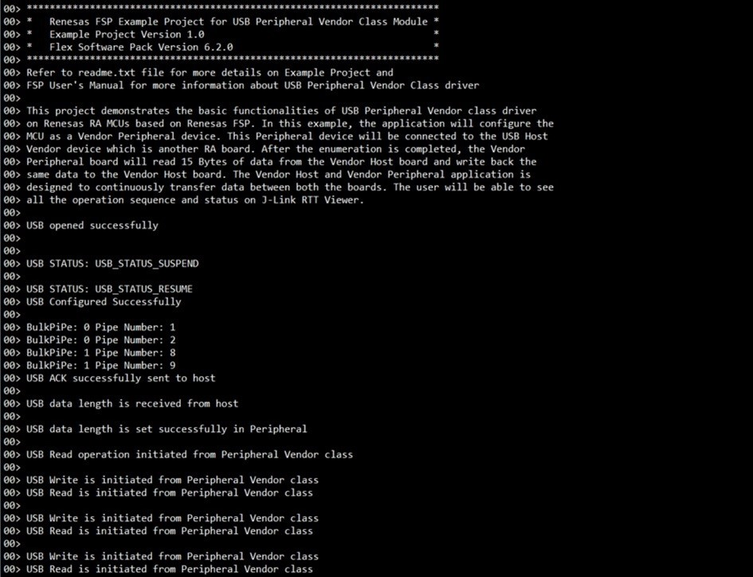

# Introduction #
The sample code accompanying with this file shows operation of a Peripheral Vendor class using the USB FS peripheral on a RA MCU. In this example, the application will configure the USB IP on the MCU as a Vendor Peripheral device. This Peripheral device will be connected to another RA MCU operating as USB Host servicing Vendor class requests. After the enumeration is completed, the Vendor Peripheral board will write a fixed amount (default: 15 Bytes) of data to the Vendor Host board which is relayed back by the Host.

Please refer to the [Example Project Usage Guide](https://github.com/renesas/ra-fsp-examples/blob/master/example_projects/Example%20Project%20Usage%20Guide.pdf) 
for general information on example projects and [readme.txt](./readme.txt) for specifics of operation.

## Required Resources ##
To build and run the usb peripheral vendor example project, the following resources are needed.

### Software ###
Refer to software described in [Example Project Usage Guide](https://github.com/renesas/ra-fsp-examples/blob/master/example_projects/Example%20Project%20Usage%20Guide.pdf)

### Hardware ###
* Supported RA boards: EK-RA2A1, EK-RA4E2, EK-RA4M1, EK-RA4M2, EK-RA4M3, EK-RA6E2, EK-RA6M1, EK-RA6M2, EK-RA6M3, EK-RA6M3G, EK-RA6M4, EK-RA6M5, EK-RA8M1, EK-RA8D1, MCK-RA8T1, EK-RA4L1, EK-RA8E2, EK-RA8P1, EK-RA8M2, EK-RA8D2, MCK-RA8T2
  * 2 x Renesas RA boards:
    * 1 x RA board runs the USB PVND example project.
    * 1 x RA board runs the USB HVND example project.
  * 1 x USB OTG cable.
  * 3 x Type-C USB cables.
    * 2 x Type-C USB cables for programming and debugging.
    * 1 x Type-C USB cable used to connect the RA board1 to the RA board2 through OTG cable.

### Hardware Connections: ###
* Connect Board1, running USB PVND example project, through OTG cable to Board2, running USB HVND example project.
* Connect USB debug ports of the two RA boards to USB ports of the host PC via two USB cables.

* For EK-RA2A1, EK-RA4M1, EK-RA6M1, EK-RA6M2 (Full-Speed):
  * Connect micro-AB USB Full Speed port (J9) of the Board1 to Board2 via a micro USB cable through OTG Cable.

* For EK-RA4E2, EK-RA6E2 (Full-Speed):
  * Connect micro-AB USB Full Speed port (J11) of the Board1 to Board2 via a micro USB cable through OTG Cable.

* For EK-RA4M2, EK-RA4M3, EK-RA6M4, EK-RA6M5, EK-RA8M1, EK-RA8D1 (Full-Speed):
  * Jumper J12 placement is pins 2-3.
  * Connect jumper J15 pins.
  * Connect micro-AB USB Full Speed port (J11) of the Board1 to Board2 via a micro USB cable through OTG Cable.

* For MCK-RA8T1 (Full-Speed):
  * Jumper JP9 placement is pins 2-3.
  * Connect jumper JP10 pins.
  * Connect Type-C USB Full Speed port (CN14) of the Board1 to Board2 via a Type-C USB cable through OTG Cable.

* For EK-RA4L1 (Full-Speed):
  * The user must turn ON S4-4 to select USB device mode.
  * Set J17 jumper to pins 2-3, Set J7 jumper to use P407 for USBFS VBUS.
  * Connect Type-C USB Full Speed port (J11) of the Board1 to Board2 via a Type-C USB cable through OTG Cable.

* For EK-RA8E2, EK-RA8P1, EK-RA8D2, EK-RA8M2 (Full-Speed):
  * For EK-RA8M2: The user must place jumper J6 on pins 2-3, J8 on pins 1-2, J9 on pins 2-3, and J29 on pins 1-2, 3-4, 5-6, 7-8 to use the on-board debug functionality.
  * Connect Type-C USB Full Speed port (J11) of the Board1 to Board2 via a Type-C USB cable through OTG Cable.

* For MCK-RA8T2 (Full Speed):
  * Jumper JP6: Connect pins 2-3.
  * Connect Jumper JP7 pins.
  * Connect Type-C USB Full Speed port (CN18) of the Board1 to Board2 via a Type-C USB cable through OTG Cable.

* For EK-RA6M3, EK-RA6M3G (High-Speed):
  * Jumper J7 placement is pins 2-3.
  * Connect jumper J17 pins.
  * Connect micro-AB USB High Speed port (J6) of the Board1 to Board2 via a micro USB cable through OTG Cable.

* For EK-RA8D2 (High-Speed):
  * Connect Type-C USB High Speed port (J7) of the Board1 to Board2 via a Type-C USB cable through OTG cable.

## Related Collateral References ##
The following documents can be referred to for enhancing your understanding of the operation of this example project:
- [FSP User Manual on GitHub](https://renesas.github.io/fsp/)
- [FSP Known Issues](https://github.com/renesas/fsp/issues)

# Project Notes #
## System Level Block Diagram ##
  
In the image, show an example of the two boards connected. For e.g. Host is EK-RA6M3 Peripheral is EK-RA4M1.

## FSP Modules Used ##
List all the various modules that are used in this example project. Refer to the FSP User Manual for further details on each module listed below.

| Module Name | Usage  | Searchable Keyword (using New Stack > Search) |
|-------------|-----------------------------------------------|-----------------------------------------------|
| USB Peripheral Vendor | USB Peripheral Vendor class works by combining r_usb_basic module. | USB pvnd |

## Module Configuration Notes ##
This section describes FSP Configurator properties which are important or different from those selected by default.

|   Module Property Path and Identifier   |   Default Value   |   Used Value   |   Reason   |
| :-------------------------------------: | :---------------: | :------------: | :--------: |
| configuration.xml > Stacks > Threads > Peri Thread > Properties > Settings > Property > Common > Memory Allocation > Support Dynamic Allocation | Disabled | Enabled | This is changed to allocate memory for this object from a FreeRTOS heap. |
| configuration.xml > Stacks > Threads > Peri Thread > Properties > Settings > Property > Common > Memory Allocation > Total Heap Size | 1024 | 40000 | This is changed because Dynamic Allocation support is enabled, so application makes use of amount of RAM available in the FreeRTOS heap. |
| configuration.xml > Stacks > Threads > Peri Thread > Properties > Settings > Property > Thread > Stack size (bytes) | 1024 | 4096 | This is changed to handle its worst-case function call nesting and local variable usage. |
| configuration.xml > Stacks > Threads > Peri Thread > Properties > Settings > Property > Thread > Memory Allocation | Static | Dynamic | RTOS objects can be created using RAM that is automatically allocated from the FreeRTOS heap. |
| configuration.xml > Stacks > Threads > Peri Thread > Peri Thread Stacks > g_basic USB (r_usb_basic) > Properties > Settings > Property > Module g_basic USB (r_usb_basic) > USB Speed | Full Speed | Full Speed | Select the USB speed. |
| configuration.xml > Stacks > Threads > Peri Thread > Peri Thread Stacks > g_basic USB (r_usb_basic) > Properties > Settings > Property > Module g_basic USB (r_usb_basic) > USB Module Number | USB_IP0 Port | USB_IP0 Port | Specify the USB module number to be used. |
| configuration.xml > Stacks > Threads > Peri Thread > Peri Thread Stacks > g_basic USB (r_usb_basic) > Properties > Settings > Property > Module g_basic USB (r_usb_basic) > USB Callback | NULL | usb_peri_vendor_callback | As RTOS is used, so the callback function is set, and this callback function will notify the user about occurrence of USB events. |
| configuration.xml > Stacks > Objects > g_queue Queue > Properties > Settings > Property > Object > Queue Length (Items) | 20 | 10 | Queue length is assigned. |
| configuration.xml > Stacks > Objects > g_queue Queue > Properties > Settings > Property > Object > Memory Allocation | Static | Dynamic | This is changed to allocate memory for this object from a FreeRTOS heap. |

## API Usage ##
The table below lists the FSP provided API used at the application layer by this example project.

| API Name    | Usage                                                                          |
|-------------|--------------------------------------------------------------------------------|
| R_USB_PipeRead | This API is used to read data from host, when USB write complete event occur. |
| R_USB_PipeWrite | This API is used to write data back to host, when USB read complete event occur. |
| R_USB_PeriControlDataGet | This API is used to get data length from host. |
| R_USB_PeriControlDataSet | This API is used to set data length in peripheral. |
| R_USB_PeriControlStatusSet | This API is used to set the USB status as ACK response. |

## Verifying Operation ##
To import, build and debug the EP, *see section Starting Development* of **FSP User Manual**. After running the EP, open J-Link RTT Viewer to see the output.

* The output on **J-Link RTT Viewer** for USB PVND:

 

## Special Topics ##
### Developing Descriptor ###
Refer **Descriptor** section of [usb_peripheral_vendor_descriptor](https://renesas.github.io/fsp/group___u_s_b___p_v_n_d.html) for developing a descriptor.
The template file provided can be placed in the src folder after removing the .template file extension.
