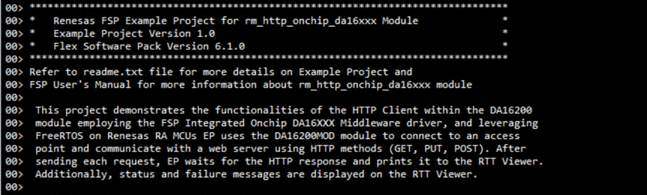

# Introduction #

This project demonstrates the functionalities of the HTTP Client within the DA16200 module, employing the FSP Integrated Onchip DA16XXX Middleware driver, and leveraging FreeRTOS on Renesas RA MCUs. EP uses the US159-DA16200EVZ Ultra Low Power Wi-Fi Pmod™ module to connect to an access point and communicate with a web server using HTTP methods (GET, PUT, POST). After sending each request, EP waits for the HTTP response and prints it to the RTT Viewer. Additionally, status and failure messages are displayed on the RTT Viewer.

Please refer to the [Example Project Usage Guide](https://github.com/renesas/ra-fsp-examples/blob/master/example_projects/Example%20Project%20Usage%20Guide.pdf) for general information on example projects and [readme.txt](./readme.txt) for specifics of the operation.

## Required Resources ##
To build and run the example project, the following resources are needed.

### Software ###
* Renesas Flexible Software Package (FSP): Version 6.2.0
* e2 studio: Version 2025-10
* SEGGER J-Link RTT Viewer: Version 8.74
* LLVM Embedded Toolchain for ARM: Version 18.1.3

Refer to the software required section in [Example Project Usage Guide](https://github.com/renesas/ra-fsp-examples/blob/master/example_projects/Example%20Project%20Usage%20Guide.pdf) for basic information on setting up and using the above software.

### Hardware ###
* Supported RA boards: EK-RA6M5, EK-RA2A2, EK-RA2L1, EK-RA4E2, EK-RA4M1, EK-RA4M2, EK-RA4M3, EK-RA6E2, EK-RA6M1, EK-RA6M2, EK-RA6M3, EK-RA6M3G, EK-RA6M4, EK-RA8D1, EK-RA8M1, FPB-RA4E1, FPB-RA6E1, MCK-RA4T1, MCK-RA6T2, MCK-RA6T3, MCK-RA8T1, EK-RA8P1, EK-RA4C1, MCK-RA8T2
  * 1 x Renesas RA board.
  * 1 x USB cable for programming and debugging.
    * Type-C USB cable: MCK-RA4T1, MCK-RA6T2, MCK-RA6T3, MCK-RA8T1, EK-RA8P1, EK-RA4C1, MCK-RA8T2.
    * Micro USB cable: the other boards.
  * 1 x Wi-Fi router Access Point(AP) with internet access. Note: WiFi router AP's credentials should be known.
  * 1 x US159-DA16200EVZ Ultra Low Power Wi-Fi Pmod™ (Part Number: US159-DA16200MEVZ) (SDK v3.2.9.2).
    * Note: Please ensure the Pmod™ SDK is up-to-date before executing the project. For SDK update instructions, please refer to Section 5, 6, and 7 in the provided link: https://www.renesas.com/en/document/apn/da16200da16600-sdk-update-guide

### Hardware Connections ###
* For EK-RA4M1, EK-RA6M1, EK-RA6M2:
  1) Plug in the US159-DA16200MEVZ to the PMODA connector on the MCU evaluation kit and be careful to align Pin 1 on the module to Pin 1 on the MCU kit.
  2) Connect the USB Debug port on the RA board to the PC using a Micro USB cable.

* For EK-RA4M2, EK-RA4M3, EK-RA6M3, EK-RA6M3G:
  1) Plug in the US159-DA16200MEVZ to the PMOD1 connector on the MCU evaluation kit and be careful to align Pin 1 on the module to Pin 1 on the MCU kit.
  2) Connect the USB Debug port on the RA board to the PC using a Micro USB cable.

* For EK-RA6M5, EK-RA2L1, EK-RA4E2, EK-RA6E2, EK-RA6M4, EK-RA8D1, EK-RA8M1, FPB-RA4E1, FPB-RA6E1:
  1) Plug in the US159-DA16200MEVZ to the PMOD2 connector on the MCU evaluation kit and be careful to align Pin 1 on the module to Pin 1 on the MCU kit.
  2) Connect the USB Debug port on the RA board to the PC using a Micro USB cable.

* For MCK-RA4T1, MCK-RA6T3, EK-RA8P1:
  1) Plug in the US159-DA16200MEVZ to the PMOD2 connector on the MCU evaluation kit and be careful to align Pin 1 on the module to Pin 1 on the MCU kit.
  2) Connect the USB Debug port on the RA board to the PC using a Type-C USB cable.

* For EK-RA2A2:  
  * Connect
    1) Renesas US159-DA16200MEVZ UART Pmod RXD (J1:2) ----> P501/TXD3 (J1:1)
    2) Renesas US159-DA16200MEVZ UART Pmod TXD (J1:3) ----> P500/RXD3 (J4:19)
    3) Renesas US159-DA16200MEVZ UART Pmod GND (J1:5) ----> GND (J18:6)
    4) Renesas US159-DA16200MEVZ UART Pmod VCC (J1:6) ----> VCC (J4:1)
    5) Renesas US159-DA16200MEVZ UART Pmod RES (J1:8) ----> P203/RESET (J3:9)  
  * Note: If using Pmod2 on EK-RA2A2, it is necessary to solder jumper Ex3.
  * Connect the USB Debug port on EK-RA2A2 to the PC using a Micro USB cable.

* For MCK-RA6T2:  
  * Connect
    1) Renesas US159-DA16200MEVZ UART Pmod RXD (J1:2) ----> PD05/TXD9 (CN10:3)
    2) Renesas US159-DA16200MEVZ UART Pmod TXD (J1:3) ----> PD06/RXD9 (CN10:2)
    3) Renesas US159-DA16200MEVZ UART Pmod GND (J1:5) ----> GND (CN6:32)
    4) Renesas US159-DA16200MEVZ UART Pmod VCC (J1:6) ----> VCC (CN6:34)
    5) Renesas US159-DA16200MEVZ UART Pmod RES (J1:8) ----> PA12/RESET (CN6:12)
  * Connect the USB Debug port on MCK-RA6T2 to the PC using a Type-C USB cable.

* For MCK-RA8T1:  
  * Connect
    1) Renesas US159-DA16200MEVZ UART Pmod RXD (J1:2) ----> P112/TXD0 (CN2:1)
    2) Renesas US159-DA16200MEVZ UART Pmod TXD (J1:3) ----> P113/RXD0 (CN1:33)
    3) Renesas US159-DA16200MEVZ UART Pmod GND (J1:5) ----> GND (CN1:30)
    4) Renesas US159-DA16200MEVZ UART Pmod VCC (J1:6) ----> VCC (CN1:23)
    5) Renesas US159-DA16200MEVZ UART Pmod RES (J1:8) ----> P114/RESET (CN1:31)
  * Connect the USB Debug port on MCK-RA8T1 to the PC using a Type-C USB cable.

* For EK-RA4C1:  
  * The user must place jumper J6 on pins 2-3, J8 on pins 1-2, J9 on pins 2-3 and turn OFF SW4-4 to use the on-board debug functionality.  
  * The user must close E52 to use P305 for RST pin of PMOD2.
  * Connect
    1) Renesas US159-DA16200MEVZ UART Pmod RXD (J1:2) ----> P115/TXD1 (J2:35)
    2) Renesas US159-DA16200MEVZ UART Pmod TXD (J1:3) ----> P608/RXD1 (J2:37)
    3) Renesas US159-DA16200MEVZ UART Pmod GND (J1:5) ----> GND (J2:1)
    4) Renesas US159-DA16200MEVZ UART Pmod VCC (J1:6) ----> VCC (J1:1)
    5) Renesas US159-DA16200MEVZ UART Pmod RES (J1:8) ----> P305/RESET (J2:38)
  * Connect the USB Debug port on EK-RA4C1 to the PC using a Type-C USB cable.

* For MCK-RA8T2:
  1) Plug in the US159-DA16200MEVZ to the PMOD Type3A/6A (CN6) connector on the MCU evaluation kit and be careful to align Pin 1 on the module to Pin 1 on the MCU kit.
  2) Connect the USB Debug port on the RA board to the PC using a Type-C USB cable.

## Related Collateral References ##
The following documents can be referred to for enhancing your understanding of the operation of this example project:
- [FSP User Manual on GitHub](https://renesas.github.io/fsp/)
- [FSP Known Issues](https://github.com/renesas/fsp/issues)

# Project Notes #

## System Level Block Diagram ##
 High level block diagram
 

 
## FSP Modules Used ##
List all the various modules that are used in this example project. Refer to the FSP User Manual for further details on each module listed below.

| Module Name | Usage | Searchable Keyword  |
|-------------|-----------------------------------------------|-----------------------------------------------|
| HTTP Client/Server on DA16XXX | The HTTP Onchip da16xxx Middleware is used to communicate with the HTTP server over a Wi-Fi network using the DA16XXX module. | rm_http_onchip_da16xxx |

## Module Configuration Notes ##
This section describes FSP Configurator properties which are important or different from those selected by default.

|   Module Property Path and Identifier   |   Default Value   |   Used Value   |   Reason   |
| --------------------------------------- | ----------------- | ---------------| ---------- |
| configuration.xml > Stacks > HTTP Client Thread > Properties > Settings > Property > Common > General > Use Mutexes | Disabled | Enabled | Enabled to include mutex functionality. |
| configuration.xml > Stacks > HTTP Client Thread > Properties > Settings > Property > Thread > Stack size (bytes) | 1024 | 2048 | RAM is used to obtain memory allocation. |
| configuration.xml > Stacks > HTTP Client Thread > HTTP Client/Server on DA16XXX (rm_http_onchip_da16xxx) > Wifi DA16XXX Framework Driver (rm_wifi_da16xxx) > DA16XXX Transport on UART (rm_at_transport_da16xxx_uart) > Properties > Settings > Property > Module Reset Port | 06 | 04 | Setup reset port for the MCU. |
| configuration.xml > Stacks > HTTP Client Thread > HTTP Client/Server on DA16XXX (rm_http_onchip_da16xxx) > Wifi DA16XXX Framework Driver (rm_wifi_da16xxx) > DA16XXX Transport on UART (rm_at_transport_da16xxx_uart) > Properties > Settings > Property > Module Reset Pin | 03 | 12 | Setup reset pin for the MCU. |
| configuration.xml > Stacks > g_uart0 UART (r_sci_b_uart) > Properties > Settings > Property > Module g_uart0 UART (r_sci_b_uart) > General > Channel | 0 | 4 | PMOD Type3A/6A is available on UART channel 4. |
| configuration.xml > Stacks > g_uart0 UART (r_sci_b_uart) > Properties > Settings > Property > Pins > TXD4 | unavailable | P415 | Select TX pin. |
| configuration.xml > Stacks > g_uart0 UART (r_sci_b_uart) > Properties > Settings > Property > Pins > RXD4 | unavailable | P414 | Select RX pin. |

The table below lists the FSP provided API used at the application layer in this example project.

| API Name    | Usage                                                                          |
|-------------|--------------------------------------------------------------------------------|
| WIFI_On | This API is used to turn on Wi-Fi module and initialize the drivers. |
| WIFI_Scan | This API is used to perform a Wi-Fi network Scan. |
| WIFI_ConnectAP | This API is used to connect to the Wi-Fi Access Point (AP). |
| WIFI_IsConnected | This API is used to check if the Wi-Fi is connected. |
| WIFI_GetIPInfo | This API is used to get IP configuration (IP address, NetworkMask, Gateway and DNS server addresses). |
| WIFI_Disconnect | This API is used to disconnect from the currently connected Access Point. |
| WIFI_Off | This API is used to turn off the Wi-Fi module. |
| RM_HTTP_DA16XXX_Open | This API is used to initialize the DA16XXX on-chip HTTP Client service. |
| RM_HTTP_DA16XXX_Send | This API is used to send the HTTP request with the configured buffers. |
| RM_HTTP_DA16XXX_Close | This API is used to close the DA16XXX HTTP Client service. |

## Verifying Operation ##
1. Set up hardware connections.
2. Import, generate, build, and download project to the RA board.
3. wifi_on_chip_http_client banner print and EP information:

4. Initialize Wifi successfully and print a menu for the user to choose from:

5. The user presses '1' to scan for WiFi APs and prints a list of WiFi access points for the user to select.

6. Enter the WiFi index and password for WiFi connection.

7. After step 4, the user can press '2' to enter WiFi AP credentials manually.

8. Connecting to Wifi access point, on successful connection the EP displays the MCU IP address:    

9. After successfully connecting to Wifi, print the HTTP method menu for the user to choose from: 

10. The user presses '1' to make an HTTP GET request

11. The user presses '2' to make an HTTP PUT request

12. The user presses '3' to make an HTTP POST request

